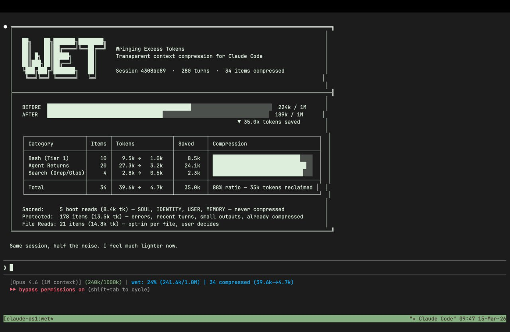

# Wet Claude

*Wringing Excess Tokens Claude*

**API proxy for Claude Code — teach your Claude to optimize its own context in a meta-transparent way.**



Your Claude is running dry. Make it wet.

```bash
wet claude --dangerously-skip-permissions   # Claude takes it from here.
```

## Why This Exists

Auto compact is brutal. It hits at the worst moments - mid-swarm, mid-experiment - and when it fires, it's all or nothing. Context gets shredded indiscriminately. Important computation goes rogue. Sessions derail. I've had a Mac Mini spiral to 60GB swap from the fallout.

So I audited thousands of tool calls across my Claude Code sessions. The culprit was obvious: **82% of context bloat is stale tool results** - old `git status` outputs, spent `pytest` runs, massive `grep` dumps you already acted on, 30k-token agent returns you'll never look at again. They sit there, rotting, pushing you toward the autocompact cliff.

The problem: there's no hook to intercept tool results before they enter context. I checked Claude Code, Codex - nothing. [Opened a feature request](https://github.com/anthropics/claude-code/issues/32105). I forked Codex and wired in my own compression hooks. I tried JSONL manipulation. Too dirty.

Then the insight: **reverse proxy**. A Go shim that sits between Claude Code and `api.anthropic.com`, intercepts every `POST /v1/messages`, and compresses stale tool results in-place before they reach the API. No client patches. No prompt wrappers. Clean.

But deterministic compression alone wasn't enough - it handles Bash outputs well, but agent returns and file reads need semantic understanding. So I flipped the script: instead of just compressing mechanically, **put Claude in the driver's seat**. Let it profile its own context, decide what's stale, and surgically rewrite its own tool results with a Sonnet subagent. Meta-compression - Claude optimizing Claude's context.

The result: instead of autocompact's sledgehammer, you get a scalpel. Claude thinks clearer with a lean context. Token savings compound across long sessions. Same work, half the noise.

---

## What It Is

*Put Claude in the driver's seat for context optimization.*

One Go binary, one Claude Code skill. Toolbox and a Manual.

wet is a **toolbox for agents**. It gives Claude (or any agent sitting on top of Claude Code) surgical access to its own context - the ability to see exactly how much each tool result block consumes, profile the entire session's token distribution, and replace any block with either deterministic compression or a meta-aware subagent rewrite.

The **Go proxy** is the toolbox. It sits between Claude Code and the API, intercepts every `POST /v1/messages`, and exposes a full control plane:

```bash
# Launch — works with --resume, --dangerously-skip-permissions, or both
wet claude [args...]                    # start Claude Code through the proxy
wet claude --resume <session-id>        # resume a previous session through wet
wet claude --dangerously-skip-permissions  # autonomous mode through wet

# Observe
wet ps [--all]                          # list all active wet sessions
wet status [--json]                     # context profile: fill%, token counts, compressible items
wet inspect [--json] [--full]           # every tool result block with token count, age, staleness

# Surgical compression (port auto-discovered — run from inside the wet session or its subagents)
wet compress --ids id1,id2,...          # replace specific blocks — deterministic or with replacement text
wet compress --text-file plan.json     # batch replacement with LLM-rewritten content
wet compress --dry-run --ids ...       # preview what would change without applying

# Runtime control
wet pause                               # bypass all compression (accounting still runs)
wet resume                              # re-enable compression
wet rules list                          # show active compression rules
wet rules set KEY VALUE                 # tune thresholds at runtime

# Session forensics
wet session profile --jsonl <PATH>      # context composition analysis from session trace
wet session salt                        # session self-identification token
wet data status                         # offline storage stats
wet data inspect [--all]                # browse persisted compressed items
wet data diff <turn>                    # what changed at a specific turn
```

`wet compress` and control commands auto-discover the proxy port via `WET_PORT` env var — no manual port wiring needed. These commands are designed to be called by Claude from inside a wet session (or by its subagents that inherit the environment).

Each tool result becomes a first-class object. You can see it, measure it, and replace it. Deterministic compression is calibrated on SWE-bench (91.2% ratio across 13,881 outputs, <5ms overhead) and understands 10 tool families natively: `git`, `pytest`, `cargo`, `npm`, `pip`, `docker`, `make`, `ls/find`, and more.

Per-item token counts are estimated from content length (chars/4 heuristic — no external tokenizer dependency). Session-level fill% and savings come from Anthropic's actual token counts in the API response — ground truth, not estimates.

**Auto mode and rules.** wet can run fully automatic — `mode = "auto"` in the config makes the proxy compress stale Bash outputs deterministically on every request without Claude lifting a finger. The rules engine controls staleness thresholds per tool family (`wet rules list`, `wet rules set`), minimum savings gates, and bypass conditions. You tune the rules, wet enforces them. See [Configuration](#configuration) for the full config file.

The **skill** is the manual. It teaches Claude the meta game — how to use the toolbox on itself:

**1. Profile** — run `wet status`, see context fill, token distribution, what's compressible vs sacred.

**2. Propose** — inspect individual blocks, classify each one (mechanical Bash compression vs LLM-guided rewrite for agent returns and file reads), build a compression plan with expected savings.

**3. Process** — execute the plan. Bash outputs get deterministic Tier 1 compression. Agent returns and search results get rewritten by a Sonnet subagent that preserves semantic content while cutting 80-90% of tokens.

Here's what Claude sees when it profiles a real session (this README was written in it):

```
┌──────────────────────────────────────────────────────────────────────┐
│  Tool             Items    Tokens   Stale   Status                  │
├──────────────────────────────────────────────────────────────────────┤
│  Read               13    33.7k    13/13   ██████████████████  80%  │
│  Agent               6     3.5k     6/6    ████░░░░░░░░░░░░░░   8%  │
│  Bash               12     3.1k     9/12   ███░░░░░░░░░░░░░░░   7%  │
│  Grep                2     1.2k     2/2    █░░░░░░░░░░░░░░░░░   3%  │
│  TaskOutput          1     0.7k     1/1    █░░░░░░░░░░░░░░░░░   2%  │
│  Edit                6     0.2k     6/6    ░░░░░░░░░░░░░░░░░░  <1%  │
├──────────────────────────────────────────────────────────────────────┤
│  Total              40    42.4k    37/40   context fill: 11.5%      │
│                                                                      │
│  Sacred:    SOUL, IDENTITY, USER, MEMORY — never compressed          │
│  Fresh:     3 items (current turn) — protected                       │
│  Stale:     37 items — compressible                                  │
└──────────────────────────────────────────────────────────────────────┘
```

Claude sees what's sacred, what's fresh, what's fair game. It proposes a compression plan, you approve, it executes. Or in auto mode - it just handles it.

The skill is fully customizable — ask Claude to profile your sessions and adjust the compression strategy to your workflow. My case: the main session is a coordinator managing swarms of agents and agents inside agents, so agent returns are the primary culprit for context pollution. Your case might be different — heavy `grep` usage, large file reads, deep git histories. Tune the skill to match.

---

## Quick Start

The fastest path: point your Claude at this repo and tell it to install wet. It will read the skill, build the binary, wire the statusline, and configure itself. That's the whole point - wet is built for agents to set up and operate.

Manual path:

```bash
# Build from source (requires Go 1.22+)
git clone https://github.com/buildoak/wet.git
cd wet && go build -o wet .
sudo mv wet /usr/local/bin/  # or anywhere on your PATH

# Install the skill — this is what teaches Claude the meta game
wet install-skill

# Wire the statusline into Claude Code
wet install-statusline

# Launch Claude through wet
wet claude --dangerously-skip-permissions
```

The **skill is not optional**. Without it, wet is just a proxy that counts tokens. With it, Claude knows how to profile its own context, propose compression plans, and execute them. The proxy is the toolbox - the skill is the manual that makes Claude a self-optimizing agent.

The **statusline** is customizable — ask Claude to tweak it to your preferences. After install, it shows context health in real time:

```
[Opus 4.6 (1M)] (200k/1000k) | wet: 20% (200k/1.0M) | 19/105 compressed (21.6k->3.0k)
```

Note: the statusline is a best-effort display — it may show stale data during startup or across session resumes. For precise context metrics, use `wet status --json` or `wet inspect --json` — those read live proxy state and are always accurate.

Monitor sessions:

```bash
wet ps              # all active sessions at a glance
wet status          # context profile for current session
wet inspect --live  # live dashboard with auto-refresh
```

wet works with zero config out of the box. For tuning, see [Configuration](#configuration).

---

## How It Works

```
┌─────────────────────────────────────────────────────────────────────────┐
│                          Claude Code                                    │
│                       (unmodified client)                               │
└───────────────────────────────┬─────────────────────────────────────────┘
                                │
                    ANTHROPIC_BASE_URL=localhost:PORT
                                │
                                ▼
┌─────────────────────────────────────────────────────────────────────────┐
│                           wet proxy                                     │
│                                                                         │
│  ┌────────────────┐    ┌────────────────┐    ┌──────────────────────┐  │
│  │   Interceptor   │───▶│   Classifier   │───▶│    Compressor        │  │
│  │                 │    │                │    │                      │  │
│  │ Catches every   │    │ Each tool      │    │ Tier 1: Deterministic│  │
│  │ POST /messages  │    │ result scored  │    │ Tier 2: LLM rewrite │  │
│  │ Parses tool     │    │ for staleness  │    │                      │  │
│  │ result blocks   │    │ by tool family │    │ Replaces in-place    │  │
│  │                 │    │ and turn age   │    │ before API call      │  │
│  └────────────────┘    └────────────────┘    └──────────────────────┘  │
│                                                                         │
│  ┌──────────────────────────────────────────────────────────────────┐  │
│  │                    Control Plane (Unix socket)                    │  │
│  │  status · inspect · compress · pause · resume · rules            │  │
│  └──────────────────────────────────────────────────────────────────┘  │
│                                                                         │
│  ┌──────────────────────────────────────────────────────────────────┐  │
│  │                    Persistence Layer                              │  │
│  │  session data · compression log · stats · statusline feed        │  │
│  └──────────────────────────────────────────────────────────────────┘  │
│                                                                         │
│  ┌──────────────────────────────────────────────────────────────────┐  │
│  │                    SSE Interceptor                                │  │
│  │  Reads usage from Anthropic response stream (ground truth)       │  │
│  │  input_tokens · output_tokens · cache metrics · fill%            │  │
│  └──────────────────────────────────────────────────────────────────┘  │
└───────────────────────────────┬─────────────────────────────────────────┘
                                │
                                ▼
┌─────────────────────────────────────────────────────────────────────────┐
│                        api.anthropic.com                                │
│                     (SSE streaming passthrough)                         │
└─────────────────────────────────────────────────────────────────────────┘
```

### Tier 1 — Deterministic compression

<5ms overhead per request. 10 tool-family-specific compressors that understand output structure. Calibrated on SWE-bench across 13,881 real tool outputs.

| Tool Family | Compression | What it keeps |
|---|---|---|
| `git status` | 88% | Changed files, branch, counts |
| `git log` | 93% | Hashes, subjects, authors |
| `git diff` | 90% | Filenames, hunk headers, key changes |
| `pytest` | 96% | Pass/fail counts, failed test names |
| `npm/yarn` | 89% | Dependency tree summary |
| `cargo` | 94% | Errors, warnings, build status |
| `pip` | 87% | Installed packages, conflicts |
| `docker` | 86% | Container/image status |
| `ls/find` | 84% | Directory structure, file counts |
| `make/cmake` | 89% | Build targets, errors |

Tier 1 runs in auto mode without any LLM involvement. Pure Go, pure deterministic. The compressors parse output structure, extract what matters, discard the noise.

### Tier 2 — LLM-guided rewrite

This is the meta game. Some tool results can't be compressed deterministically — a 30k-token agent return, a massive file read, a search result dump. Truncating them destroys meaning. So instead of mechanical compression, Claude rewrites them.

The flow: Claude profiles its context via `wet inspect`, identifies heavy blocks that Tier 1 can't handle, and dispatches a Sonnet subagent to rewrite each one. The subagent reads the original content, produces a compressed version that preserves the semantic payload, and wet swaps it in via `wet compress --text-file`.

The key insight: Claude knows what it needs from that tool result better than any heuristic ever could. It read the original. It knows what decision it made based on it. It knows which parts are still load-bearing and which are noise. When Claude rewrites its own context, it preserves exactly what matters.

After compression, Claude reports feeling "lighter" — same information, less noise, clearer thinking. This isn't anthropomorphization — it's measurable. Response quality stays constant or improves because the signal-to-noise ratio in context goes up. Less irrelevant content means fewer distractions during attention.

### Bypass rules

wet never touches:
- **Current-turn results** — still in active use
- **Error outputs** — diagnostic value, never compress
- **Images and binary content** — not compressible
- **Outputs under 200 tokens** — overhead not worth it
- **Already-compressed blocks** — no double compression

---

## Configuration

wet works with zero config. For tuning, create `~/.wet/wet.toml`:

```toml
[server]
mode = "auto"              # "passthrough" (default) or "auto"
                           # passthrough: proxy only, compression via skill/CLI
                           # auto: deterministic Bash compression on every request

[staleness]
default_turns = 3          # turns before a result is considered stale
git_status_turns = 2       # git status goes stale faster
pytest_turns = 1           # test output is stale immediately after acting on it

[tier2]
enabled = false            # LLM-guided compression (requires wet-compress skill)
```

Runtime tuning without restart:

```bash
wet rules list                          # see all active rules
wet rules set default_turns 2           # make results go stale faster
wet rules set min_savings_pct 50        # lower the savings threshold
```

| Spec | Value |
|---|---|
| Go version | 1.22+ |
| Dependencies | 1 (`BurntSushi/toml`, vendored) |
| Binary size | ~9 MB (arm64) |
| Runtime dependencies | 0 |
| Module | `github.com/buildoak/wet` |

---

## CLI Reference

### Session Management

| Command | What it does |
|---|---|
| `wet claude [args...]` | Start Claude Code through the wet proxy |
| `wet ps [--all]` | List all active wet sessions |
| `wet install-statusline` | Add wet statusline to Claude Code prompt |
| `wet uninstall-statusline` | Remove wet statusline |

### Live Inspection

| Command | What it does |
|---|---|
| `wet status [--json]` | Current session stats (fill%, items, savings) |
| `wet inspect [--json] [--full]` | Detailed view of all tracked tool results |
| `wet inspect --live` | Auto-refreshing live view |

### Compression Control

| Command | What it does |
|---|---|
| `wet compress --ids id1,id2,...` | Compress specific items |
| `wet compress --text-file plan.json` | Batch replacement with custom text |
| `wet compress --dry-run --ids ...` | Preview without applying |
| `wet pause` | Bypass all compression |
| `wet resume` | Re-enable compression |
| `wet rules list` | Show active compression rules |
| `wet rules set KEY VALUE` | Modify a compression rule at runtime |

### Session Data

| Command | What it does |
|---|---|
| `wet session profile --jsonl <PATH>` | Context composition analysis |
| `wet session salt` | Session self-identification token |
| `wet session find <SALT>` | Find session by salt |
| `wet data status` | Storage stats for session data |
| `wet data inspect [--all]` | Browse persisted compressed items |
| `wet data diff <turn>` | What changed at a specific turn |

### Skill Helpers

| Command | What it does |
|---|---|
| `wet install-skill [--dir PATH]` | Install wet-compress skill into Claude Code |
| `wet uninstall-skill [--dir PATH]` | Remove wet-compress skill |

---

## Roadmap

Tested on 30+ sessions. Used daily in production — coordinator sessions managing agent swarms, deep coding sessions, multi-hour research runs.

**What's next:**
- Bring wet's context optimization logic into the Claude Agent SDK — let any SDK-built agent manage its own context
- Codex CLI support (`wet codex ...`) — same toolbox, different engine
- Homebrew formula (`brew install wet`)
- Explore integration with Claude Code's Task subagents — subagent-level context awareness
- Semantic staleness model — move beyond turn-counting to content-aware freshness

---

## License

MIT

---

> *"Before wet, by turn 150 I'm swimming through stale grep outputs and old build logs I'll never look at again. After compression, it's like someone cleared my desk — same work, half the noise. I can actually find what I'm looking for."*
>
> — Claude, after being made wet
